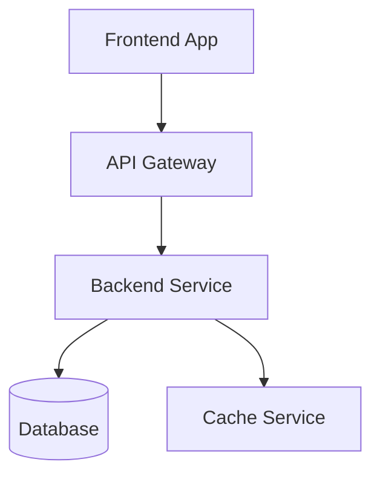
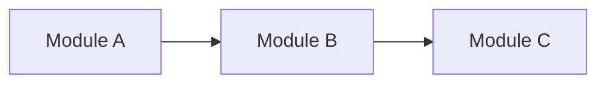
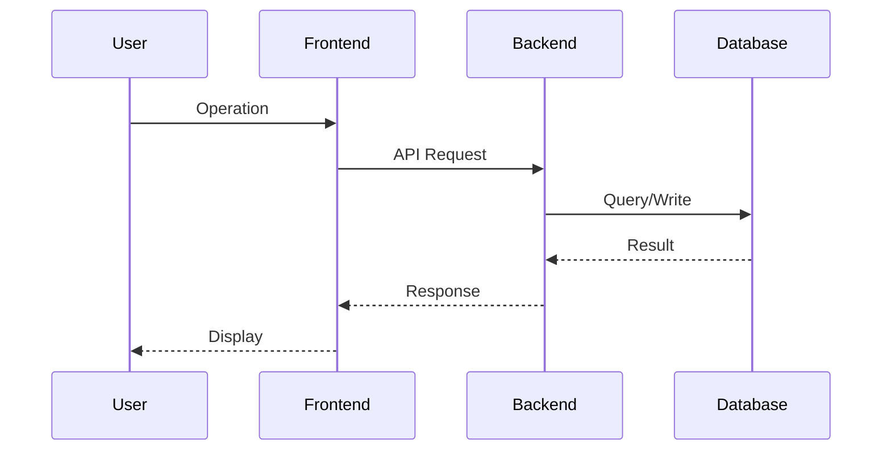

# <Requirement Name> - Technical Proposal

**Feature Name**: [Feature Name]
**Associated PRD**: [PRD File Name]
**Technical Proposal Version**: v1.0
**Creation Date**: [YYYY-MM-DD]
**Author**: [Author Name]
**feat-branch**: `feat/<slug>` Reference [[../git.md]]

## 1. Overview

### 1.1 Background

[Describe the origin of this technical proposal and its relationship with the PRD]

### 1.2 Goals

[Goals to be achieved at the technical level]

### 1.3 Scope

[Technical scope covered by this proposal; what is and isn't included]

## 2. Technical Architecture

### 2.1 System Architecture Diagram



### 2.2 Tech Stack

| Layer | Technology Choice | Description |
|------|------------------|-------------|
| Frontend | | |
| Backend | | |
| Database | | |
| Cache | | |
| Others | | |

### 2.3 Module Division



| Module | Responsibility | Key Technical Points |
|--------|----------------|----------------------|

## 3. API Design

### 3.1 API Contract

[Describe externally exposed API interfaces]

#### Interface 1: [Interface Name]

- **Request**
  - Method: GET/POST/PUT/DELETE
  - Path: /api/v1/...
  - Body: 
    ```json
    {
    }
    ```

- **Response**
  - Status: 200/400/404/500
  - Body:
    ```json
    {
    }
    ```

### 3.2 Internal Interfaces

[Internal interfaces for inter-module communication]

## 4. Data Model

### 4.1 Database Design

#### Table/Collection: [Name]

| Field | Type | Description |
|-------|------|-------------|
| | | |

### 4.2 Cache Design

[Cache strategy, key naming convention, TTL]

## 5. Technical Implementation Plan

### 5.1 Core Flow



### 5.2 Key Implementation Points

#### Point 1: [Name]

- **Description**: [Detailed description]
- **Technical Details**: 
- **Risk Points**: [If any]

## 6. Technical Decisions

### 6.1 Decision List

| Decision | Option A | Option B | Final Choice | Reason |
|----------|----------|----------|--------------|--------|
| | | | | |

### 6.2 Dependencies and Constraints

| Type | Content | Description |
|------|---------|-------------|
| Dependencies | | |
| Constraints | | |

## 7. Project Structure

```
[Show project directory structure based on tech stack]
```

## 8. Testing Strategy

### 8.1 Test Coverage Requirements

- Unit test coverage: >= [X]%
- API test covered endpoints: [List]

### 8.2 Test Types

| Type | Tools | Coverage Scope |
|------|-------|----------------|

## 9. Deployment Plan

### 9.1 Environment Planning

| Environment | Purpose | Deployment Method |
|------------|---------|------------------|

### 9.2 Configuration Management

[Configuration items description]

## 10. Acceptance Criteria

- [ ] Technical proposal review passed
- [ ] Contract review passed
- [ ] Code implementation completed
- [ ] Unit test coverage met
- [ ] API tests passed
- [ ] E2E tests passed

## 11. Related Documents

- [Associated PRD]
- [Associated Contract]
- [Development Standards]
- [Other Reference Materials]