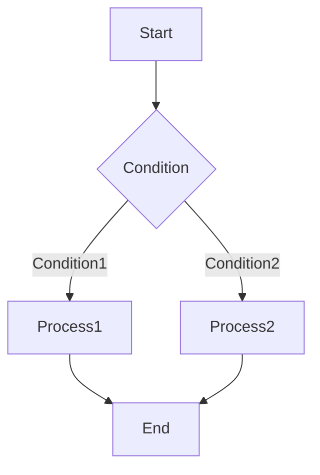

# Document Standards

Each document subdirectory is a complete, independent knowledge scope. Each folder manages all knowledge using the Zettelkasten method.

All documents should include YAML front matter at the top, for example:
```
---
description: Document description; brief explanation of the document's purpose
type: Fleeting | Literature | Permanent
---
```

## File Naming Convention

- Use a unique identifier (ID) as the file name prefix, such as `01-`, `20240101-`
- IDs are only used for sorting and deduplication; they do not represent priority or time sequence
- The title follows the ID, separated by hyphens, e.g., `01-AIMP-PRD.md`

### Atomicity Principle

- Each file is an independent knowledge atom, containing one core idea or concept
- Avoid mixing multiple topics in one file
- If content is too extensive, split into multiple files and establish links

### Linking Convention

- Use Markdown link syntax: `[[filename]]` to link files in the same directory
- Linked target files should contain sufficient context to avoid orphaned references
- Avoid excessive linking; each file should have no more than 7 bidirectional links

### Note Types

| Type | Description |
|------|-------------|
| Fleeting | Temporary thoughts; pending organization |
| Literature | Book notes / reference material summaries |
| Permanent | Independent knowledge atoms; can be cited long-term |

### Context Requirements

- Each file should include background explanation at the top, explaining the document's purpose
- When necessary, add a "Related Documents" section at the end, listing associated files

## Diagram Drawing Standards

All flowcharts, architecture diagrams, sequence diagrams, etc. in documents must be drawn using Mermaid syntax. External image files are prohibited.

### Mermaid Usage Requirements

- Wrap Mermaid syntax with ` ```mermaid ` code blocks
- Keep diagrams simple and clear; avoid overly complex diagrams
- Diagrams should have descriptive titles

**Example**:



### Supported Diagram Types

| Type | Purpose |
|------|---------|
| flowchart | Flowcharts, decision trees |
| sequenceDiagram | Sequence diagrams, interaction diagrams |
| classDiagram | Class diagrams, architecture diagrams |
| stateDiagram | State diagrams |
| entityRelationshipDiagram | ER diagrams |
| gantt | Project progress charts |
| pie | Pie charts |